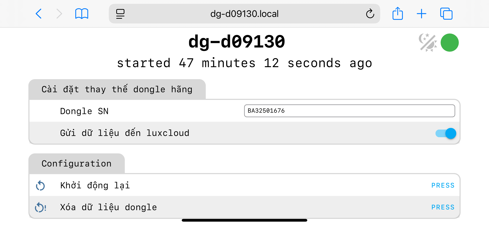

# lux dongle.

## Phương án thay thế cho dongle lux, trị bệnh offline dongle lux
- Đưa dữ liệu update 1-2s đến server của solarbox
- Đưa dữ liệu lên server lux, nhận cài đặt từ server lux như dongle hãng.
- Không thu phí server.

## Hướng dẫn sử dụng

### 1. Các đèn báo trên DIY dongle
- Đèn 1: trạng thái kết nối wifi.
- Đèn 2: trạng thái kết nối inverter.
- Đèn 3: trạng thái kết nối cloud của solarbox.
- Đèn 4: trạng thái kết nối cloud luxpower, nếu bạn có bật chức năng đẩy data về lux server.

### 2. Kết nối wifi cho dongle (chỉ làm 1 lần)

- Cấp nguồn dongle và chờ khoản 1 phút.
- Kết nối đến wifi: solarbox_dongle
- Vào địa chỉ http://192.168.4.1 để cài đặt wifi

### 3. Theo dõi biến tần từ xa
- Truy cập theo địa chỉ https://luxpower.xuantran.uk/dg-xxxxxx. Trong đó dg-xxxxxxxx là mã dongle của bạn.
- Demo: https://luxpower.xuantran.uk/dg-d09130

### 4. Gửi data đến luxcloud như dongle hãng(sử dụng trong trường hợp dongle hãng bị hỏng hoặc bạn không muốn dùng dongle hãng)
- Truy cập trang cài đặt http://dg-xxxxxx.local, Trong đó dg-xxxxxxxx là mã dongle của bạn.
- Điền Serial number của dongle của bạn (vd: BAXXXXXXXX)
- Bật chức năng gửi data đến server lux.

## FAQ
1. Q: Dongle DIY có thể thay thế hoàn toàn dongle hãng không?

    A: Không, nó chỉ đang được thử nghiệm để đẩy data và nhận cài đặt từ server lux, không có các chức năng như kết nối local, update firmware chon biến tần

2. Q: Dongle DIY có thể dùng song song với dongle hãng không

    A: Được, bạn có thể cắm dongle hãng phía sau dongle DIY.

3. Q: Server có thu phí không?

    A: Không. Mình không thu phí duy trì server.

4. Q: Server đang được đặt ở đâu

    A: server đang được đặt ở Singapore
