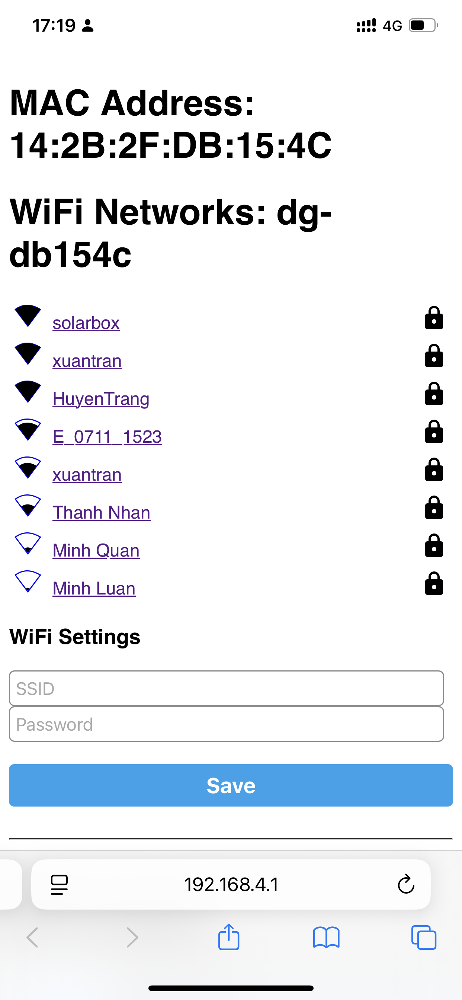

# lux dongle.

## Phương án thay thế cho dongle lux
- Đưa dữ liệu update 1-2s lên homeassistant.
- Đưa dữ liệu lên server lux, nhận cài đặt từ server lux như dongle hãng.

## Hướng dẫn sử dụng

### 1. Các đèn báo trên dongle
- Đèn 1: trạng thái kết nối wifi.
- Đèn 2: trạng thái kết nối inverter.
- Đèn 3: trạng thái kết nối cloud của solar box.
- Đèn 4: trạng thái kết nối cloud lux power nếu bạn có bật chức năng đẩy data về lux server.

### 2. Kết nối wifi cho dongle (chỉ làm 1 lần)

- Cấp nguồn dongle và chờ khoản 1 phút.
- Kết nối đến wifi: solarbox_dongle
- Vào địa chỉ http://192.168.4.1 để cài đặt wifi

### 3. Đăng nhập vào solarbox cloud

- Đăng nhập với thông tin mình gửi. [Video hướng dẫn](https://youtube.com/shorts/DpIyl63lWtc?feature=share)
- server: https://lux.xuantran.uk
- user: mã dongle dg_xxxxxx
- pass: liên hệ để nhận pass

### 4. Thay đổi một số thông tin của hệ thống của bạn
- CS lắp đặt PV: là công suất lắp đặt tổng PV của bạn (dv: W)
- CS lắp đặt PV1: là công suất lắp đặt tổng PV1 của bạn (dv: W)
- CS lắp đặt PV2: là công suất lắp đặt tổng PV2 của bạn (dv: W)
- NL Pin Lưu trữ: khả năng lưu trữ của pin/ acquy (dv Wh)

### 5. Cài đặt giới hạn dòng xả theo giờ.
- Cài đặt giới hạn dòng xả theo khung giờ.
- Bật switch "trạng thái" nếu bạn muốn sử dụng chức năng này

### 6. Gửi data đến server lux như dongle hãng
- Điền Serial number của dongle của bạn (vd: BAXXXXXXXX)
- Bật chức năng gửi data đến server lux

## FAQ
1. Q: Dongle DIY có thể thay thế hoàn toàn dongle hãng không?

    A: Không, nó chỉ đang được thử nghiệm để đẩy data và nhận cài đặt từ server lux, không có các chức năng như kết nối local, update firmware chon biến tần

2. Q: Dongle DIY có thể dùng song song với dongle hãng không

    A: Được, bạn có thể cắm dongle hãng phía sau dongle DIY.

3. Q: Khác nhau giữa dongle có hỗ trợ JK bms và không hỗ trọ JK BMS.

    A: dongle không hỗ trọ JK BMS sẽ cập nhật dữ liệu nhanh hơn

4. Q: Hiện tại dongle hỗ trợ bao nhiêu BMS JK

    A: hiện tại dongle chỉ hỗ trợ 1 bms JK.

5. Q: Server có thu phí không?

    A: Không. Những khách hàng đầu tiên sẽ được sử dụng server mà không thu phí duy trì.

6. Q: Server đang được đặt ở đâu

    A: server đang được đặt ở Singapore
